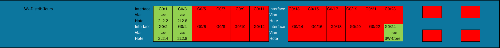

# Configuration du Switch core

## 1. Configuration de base (du nom d'hôte et d'un utilisateur pour le SSH)

### Nom d'hôte
```bash
hostname SW-distrib-tours
```

### Configuration d'un mot de passe pour acceder au mode priviliéger
```bash
enable secret password
```

### Création d'un utilisateur admin avec accès SSH

```bash
username admin privilege 15 secret admin
```

### Configuration de la bannière de message du jour (MOTD)

```bash
banner motd 
***************************************************************************
*                   	Welcome to SportLudiques Network               	*
***************************************************************************
*                                                                     	*
*   	Authorized access only. All activities are monitored.         	*
*                                                                     	*
*  	"Empowering Sports and Fun with Every Connection!"             	*
*                                                                     	*
*   	For support, contact IT at: support@sportludiques.com         	*
*                                                                     	*
***************************************************************************
```

Voici une description expliquant l'importance d'un VLAN de management pour la sécurité, intégrée dans la documentation en Markdown :

## 2. VLAN de management (VLAN 220)

### Configuration du VLAN 220
```bash
interface Vlan220
 ip address 10.10.10.20 255.255.255.0
 no shutdown
```

### Pourquoi un VLAN de management ?

Le VLAN de management est crucial pour isoler la gestion du réseau des autres trafics utilisateur. Voici les principales raisons de son importance :

- **Sécurité accrue** : En isolant les communications de gestion du reste du réseau, il devient plus difficile pour des utilisateurs non autorisés d'accéder aux équipements réseau. Cela réduit le risque de compromission.
  
- **Meilleure surveillance** : Le VLAN de management permet de suivre et de contrôler plus facilement les accès aux équipements réseau, facilitant ainsi la détection des activités suspectes.

- **Fiabilité et stabilité** : Le fait d’avoir un VLAN dédié à la gestion des équipements assure que les modifications, mises à jour et autres actions administratives ne sont pas perturbées par le trafic réseau standard.

## 3. Domaine et SSH

### Configuration du Domaine
```bash
ip domain-name example.com
```

### Configuration SSH
```bash
crypto key generate rsa modulus 2048
ip ssh version 2
line vty 0 4
 login local
 transport input ssh
```

---

### Pourquoi SSH et pas Telnet ?

**SSH (Secure Shell)** est un protocole de gestion à distance sécurisé qui crypte toutes les communications entre un administrateur et un équipement réseau. Contrairement à **Telnet**, qui transmet les données (y compris les mots de passe) en texte clair, SSH garantit que toutes les informations échangées sont chiffrées et protégées des interceptions.

Les avantages principaux de SSH sont :
- **Sécurité renforcée** : SSH chiffre toutes les données, ce qui empêche les attaques de type "man-in-the-middle" ou l'espionnage des informations sensibles telles que les mots de passe.
  
- **Authentification** : Avec SSH, il est possible d'utiliser des clés cryptographiques pour l'authentification, ce qui renforce encore plus la sécurité.

- **Confidentialité** : SSH assure que toutes les commandes exécutées et les données échangées restent privées.

## 4. Autres VLANs

### Création des VLANs avec leurs noms

<details>
<summary>Cliquez pour afficher la configuration des VLANs</summary>

```bash
vlan 220
 name Management
!
vlan 221
 name Services
!
vlan 222
 name DMZ
!
vlan 223
 name (à définir)
!
vlan 224
 name Interconnexion
!
vlan 225
 name Production
!
vlan 226
 name Conception
```
</details>

### Description des VLANs
- **VLAN 220 - Management** : Ce VLAN est utilisé pour la gestion des équipements réseau. Il permet d'isoler le trafic de gestion (comme les accès SSH ou l'administration des équipements) du reste du réseau, garantissant ainsi une meilleure sécurité et stabilité.
  
- **VLAN 221 - Services** : Ce VLAN est dédié aux services critiques du réseau, tels que les serveurs d'applications, de bases de données ou d'authentification. Il assure une communication fiable et sécurisée entre les services essentiels.

- **VLAN 222 - DMZ** : Le VLAN DMZ est utilisé pour héberger des serveurs accessibles depuis l'extérieur, tels que les serveurs web ou mail. Il offre une zone de sécurité intermédiaire entre le réseau interne et l'extérieur, protégeant le réseau principal des attaques.

- **VLAN 223 - (à définir)** : Ce VLAN est encore à définir en fonction des besoins futurs ou des évolutions du réseau. Il pourrait être utilisé pour des services spécifiques ou pour des segments supplémentaires de l'infrastructure.

- **VLAN 224 - Interconnexion** : Ce VLAN permet d'assurer la communication entre différents segments du réseau ou avec des réseaux tiers. Il est souvent utilisé pour connecter plusieurs sites ou infrastructures, facilitant l'échange de données tout en maintenant une séparation logique du trafic.

- **VLAN 225 - Production** : Ce VLAN est réservé aux systèmes et services en environnement de production. Il est conçu pour fournir des performances optimales et une sécurité renforcée aux applications critiques de l'entreprise.

- **VLAN 226 - Conception** : Utilisé par les équipes de développement et d'ingénierie, ce VLAN permet de tester de nouvelles applications ou configurations sans impacter l'environnement de production. Il garantit une séparation nette entre les activités de conception et les systèmes en cours d'utilisation.

### Assignation de l'adresse IP sur le VLAN de management

```bash
interface Vlan220
 ip address 10.10.10.20 255.255.255.0
 no shutdown
```

## 6. Configuration des Ports

### Schéma du SW-distrib



### Ports en mode Trunk
```bash
interface GigabitEthernet0/24
 switchport mode trunk
 no shutdown
```

### Ports en mode Access
```bash
interface GigabitEthernet0/1
 switchport mode access
 switchport access vlan 220
 no shutdown
!
interface GigabitEthernet0/2
 switchport mode access
 switchport access vlan 220
 no shutdown
!
interface GigabitEthernet0/3
 switchport mode access
 switchport access vlan 222
 no shutdown
!
interface GigabitEthernet0/4
 switchport mode access
 switchport access vlan 226
 no shutdown
```