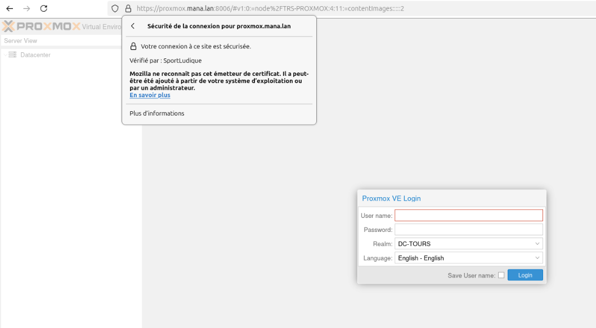

# Sécurisation de Proxmox en HTTPS avec certificat signé (ACG-SL)

## Objectif

Garantir une connexion chiffrée et de confiance à l'interface web de Proxmox via le protocole **HTTPS**, à l’aide d’un certificat **signé par l’Autorité de Certification Générale de SportLudique (ACG-SL)**.

---

## 1. Génération du certificat SSL

La génération du certificat se fait sur le serveur de l’autorité de certification interne : **trustus.mana.lan**.

### 📍 Étapes :

1. Se connecter en SSH :

```bash
ssh admin@trustus.mana.lan
```

2. Aller dans le dossier contenant l’ACG-SL :

```bash
cd ~/ACG-SL
```

3. Exécuter le script pour générer un certificat **wildcard** :

```bash
./wildcard.sh mana.lan
```

✅ Cette méthode permet d’avoir un seul certificat valide pour tous les services en `*.mana.lan`, dont `proxmox.mana.lan`.

> 🔐 Le VLAN de management étant isolé, cette méthode n'entraîne **aucun risque de sécurité** lié aux certificats wildcard.

---

## 2. Ajout DNS du FQDN `proxmox.mana.lan`

Avant de déployer le certificat, il faut s’assurer que le nom de domaine `proxmox.mana.lan` est bien **résolu en local**.

### 📍 À faire dans le serveur DNS principal `trs-srv-dns1` :

1. Ouvrir la zone `mana.lan`
2. Créer un **enregistrement A** :

| Nom               | Type | Adresse IP             |
|------------------|------|------------------------|
| proxmox.mana.lan | A    | `10.10.10.5` (exemple) |

---

## 3. Déploiement du certificat sur Proxmox

Une fois le certificat `wildcard.mana.lan.pem` et sa clé privée obtenus, les copier sur le serveur Proxmox (`10.10.10.5` dans l'exemple) :

```bash
scp wildcard.mana.lan.pem root@10.10.10.5:/etc/pve/local/pve-ssl.pem
scp wildcard.mana.lan.key root@10.10.10.5:/etc/pve/local/pve-ssl.key
```

Ensuite, redémarrer le service web de Proxmox pour activer le certificat :

```bash
systemctl restart pveproxy
```

---

## 4. Vérification via navigateur

Accéder à l'interface web depuis un poste client :

👉 https://proxmox.mana.lan:8006

Si tout est bien configuré, le **certificat est reconnu comme valide** dans le navigateur.



---

## Résultat attendu

- 🔒 Le certificat SSL wildcard couvre l’ensemble des sous-domaines `*.mana.lan`
- 🌐 Le nom `proxmox.mana.lan` pointe vers le serveur Proxmox sur le réseau de management
- ✅ L’accès est sécurisé et reconnu par le navigateur
