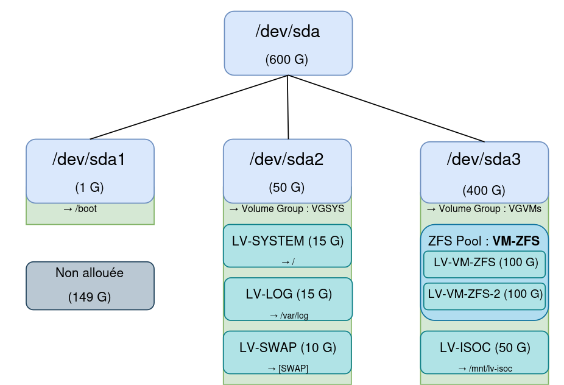
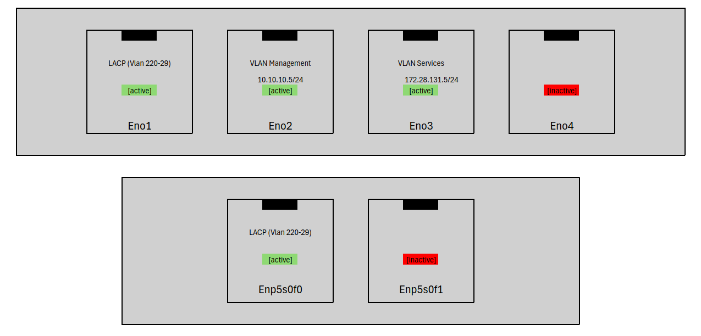

# Introduction au Projet Proxmox - SportLudique Tours

## Cahier des charges

Dans le cadre de l'amélioration de l'autonomie informatique du site de Tours, le DSI de SportLudique a défini un cahier des charges précis pour la mise en place d’un hyperviseur local basé sur **Proxmox VE**. Ce dernier doit permettre la continuité des services en cas de coupure avec le siège, tout en garantissant la sécurité et la performance de l’infrastructure.

Les éléments suivants sont requis :

- 📦 **Déploiement d’un hyperviseur Proxmox local** pour héberger un double de chaque machine critique.
- 🧱 **Configuration des disques** avec LVM pour le système et création d’un **pool ZFS** dédié aux machines virtuelles.
- 🌐 **Architecture réseau redondante** via l’usage de plusieurs interfaces physiques réparties sur différents VLANs et une agrégation LACP.
- 🔐 **Authentification centralisée** via les **identifiants Active Directory**, intégrée au domaine `lan.tours.sportludique.fr`.
- 🔒 **Connexion sécurisée en HTTPS**, avec un **certificat signé par l’ACG-SL** (Autorité de Certification Générale de SportLudique).
- 🧑‍💻 **Séparation des accès** : seul un groupe AD spécifique (ex. : `proxmox-admins`) peut accéder à l'interface d'administration.
- 📜 **Documenter** toute la procédure d'installation et de configuration pour assurer la maintenabilité du projet.

---

## Contexte

Afin de limiter la dépendance vis-à-vis du cloud centralisé géré par le siège, et dans une optique de continuité de service en cas de coupure ou de perte de liaison avec celui-ci, le DSI de SportLudique basé à Tours a décidé de mettre en place une infrastructure locale de virtualisation.

Cette infrastructure repose sur **Proxmox VE**, un hyperviseur libre et robuste, permettant de faire tourner plusieurs machines virtuelles localement. L’objectif est de **maintenir un double de chaque machine critique** au niveau local pour garantir la **redondance** et l’**autonomie** en cas d’incident.

---

## Infrastructure Disque

Le serveur physique dédié à l’hyperviseur Proxmox dispose d’un disque de **600 Go** organisé comme suit :

- `/dev/sda1` (1 Go) : contient la partition de démarrage (`/boot`).
- `/dev/sda2` (50 Go) : regroupe les volumes logiques critiques du système :
  - `LV-SYSTEM` (15 Go) → `/`
  - `LV-LOG` (15 Go) → `/var/log`
  - `LV-SWAP` (10 Go) → swap
- `/dev/sda3` (400 Go) : destiné aux machines virtuelles dans le groupe `VGVMs` :
  - Pool ZFS `VM-ZFS` :
    - `LV-VM-ZFS` (100 Go)
    - `LV-VM-ZFS-2` (100 Go)
  - Volume `LV-ISOC` (50 Go) → utilisé pour stocker les ISO à monter dans les VMs
- **149 Go** non alloués pour permettre des extensions futures.

---

## Interfaces Réseau

Le serveur est équipé de **deux cartes réseau physiques** (multi-ports), configurées pour séparer les usages (gestion, services, agrégation LACP) :

- **Carte 1 (4 ports) :**
  - `eno1` : agrégation LACP (VLAN 220-229) – [active]
  - `eno2` : réseau de gestion – IP : `10.10.10.5/24` – [active]
  - `eno3` : réseau des services – IP : `172.28.131.5/24` – [active]
  - `eno4` : port inactif
- **Carte 2 (2 ports) :**
  - `enp5s0f0` : LACP (VLAN 220-229) – [active]
  - `enp5s0f1` : inactif

Cette segmentation permet une **séparation des flux** critique pour la sécurité et les performances, tout en offrant une **tolérance aux pannes réseau** via l'agrégation LACP.

---

## Objectifs du Projet

- **Autonomie locale** en cas de coupure avec le siège.
- **Redondance des services** grâce aux VM locales.
- **Optimisation réseau** avec séparation des VLANs.
- **Facilité de maintenance** avec un système standardisé et documenté.

Ce projet s'inscrit dans une volonté plus large de **résilience** et de **maîtrise des ressources informatiques locales**.

