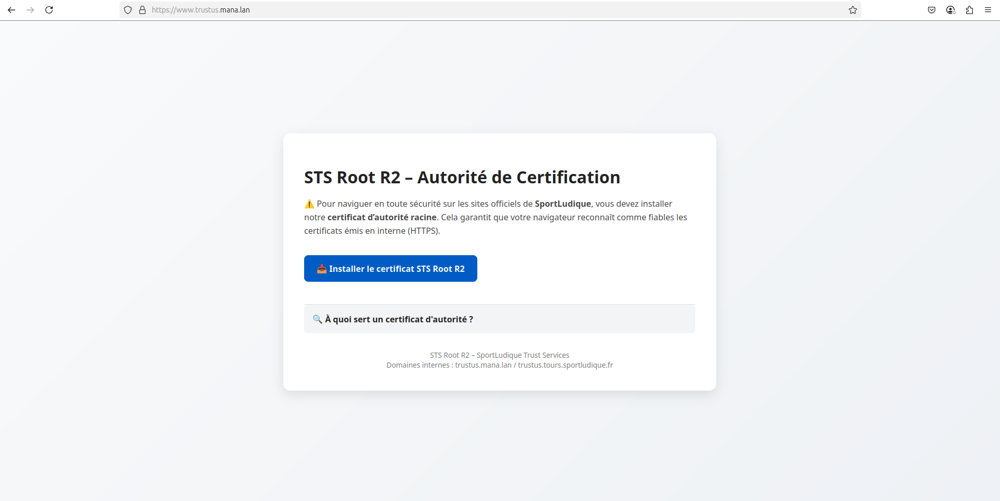

# Finalisation de la PKI : exploitation, révocation et distribution

Une fois l’OCSP et la configuration des extensions en place, la DSI a finalisé la mise en production de l’autorité STS Root R2 avec les composants suivants :

---

## 1. Mise en service automatique de l’OCSP

Pour rendre l’OCSP fiable et persistant, un service `systemd` a été créé afin que le résolveur OCSP démarre automatiquement au boot de la machine.

### Fichier `/etc/systemd/system/ocsp-responder.service`

```ini
[Unit]
Description=OCSP Responder for STS Root R2
After=network.target

[Service]
Type=simple
ExecStart=/usr/bin/openssl ocsp \
  -port 2560 \
  -index /etc/ssl/STS-Root-R2/index.txt \
  -rsigner /etc/ssl/STS-Root-R2/certs/ca.crt \
  -rkey /etc/ssl/STS-Root-R2/private/ca.key \
  -CA /etc/ssl/STS-Root-R2/certs/ca.crt \
  -text -timeout 5 -nmin 1
Restart=always

[Install]
WantedBy=multi-user.target
```

### Commandes utiles

```bash
sudo systemctl daemon-reexec
sudo systemctl enable ocsp-responder
sudo systemctl start ocsp-responder
```

Le port `2560` est expose via **Nginx** en reverse proxy pour offrir l’URL externe `http://trustus.mana.lan/ocsp`.

---

## 2. Script de révocation simplifié

Un script shell a été créé pour faciliter la révocation de certificats en proposant automatiquement les numéros de série disponibles. L’utilisateur entre un numéro, confirme, et le certificat est révoqué proprement.

### Exemple de logique du script `revoke-cert.sh`

```bash
#!/bin/bash

CA_DIR="/etc/ssl/STS-Root-R2"
INDEX="$CA_DIR/index.txt"
REVOKED="$CA_DIR/crl/revoked.txt"

echo "Certificats valides disponibles :"
grep 'V' "$INDEX" | awk '{print $3}' | nl

read -p "Entrer le numero de serie a revoquer : " serial

read -p "Confirmer la revocation du certificat $serial ? (o/n) : " confirm
[[ "$confirm" != "o" && "$confirm" != "O" ]] && { echo "Annule."; exit 1; }

openssl ca -config "$CA_DIR/openssl.cnf" -revoke "$CA_DIR/newcerts/$serial.pem"
openssl ca -gencrl -out "$CA_DIR/crl/crl.pem" -config "$CA_DIR/openssl.cnf"

echo "$serial" >> "$REVOKED"
echo "Certificat $serial revoque et CRL mise a jour."
```

Le fichier `revoked.txt` permet de garder une trace manuelle.

---

## 3. Distribution du certificat d'autorite via HTTPS

Pour faciliter l'installation du certificat d'autorite sur les postes clients (surtout ceux hors domaine), une **page web HTTPS** a ete mise en place sur le serveur `trustus`.

Elle permet de :

* Telecharger directement `ca.crt`
* Consulter la documentation de la PKI
* Voir l'etat OCSP via un lien de test

### Exemple de contenu de la page :

```html
<h1>STS Root R2 – Installation du certificat</h1>
<p>Pour faire confiance aux certificats emis par SportLudique, vous pouvez installer le certificat racine suivant :</p>

<a href="https://trustus.mana.lan/ca.crt" download>Télécharger le certificat d'autorité</a>
```

> Le fichier `ca.crt` est place dans `/var/www/html/` et serti avec un certificat SSL (auto-signe par la meme autorite pour test interne).

---

## 4. Capture d'ecran

Voici une capture d’ecran de la page web permettant l’installation manuelle du certificat racine :



## Conclusion

Grace a cette finalisation :

* Le serveur OCSP fonctionne de maniere automatique et securisee
* Les certificats peuvent etre revoques rapidement sans erreur
* Les utilisateurs peuvent installer la confiance manuellement si necessaire
* L’infrastructure PKI est exploitable et conforme aux standards modernes