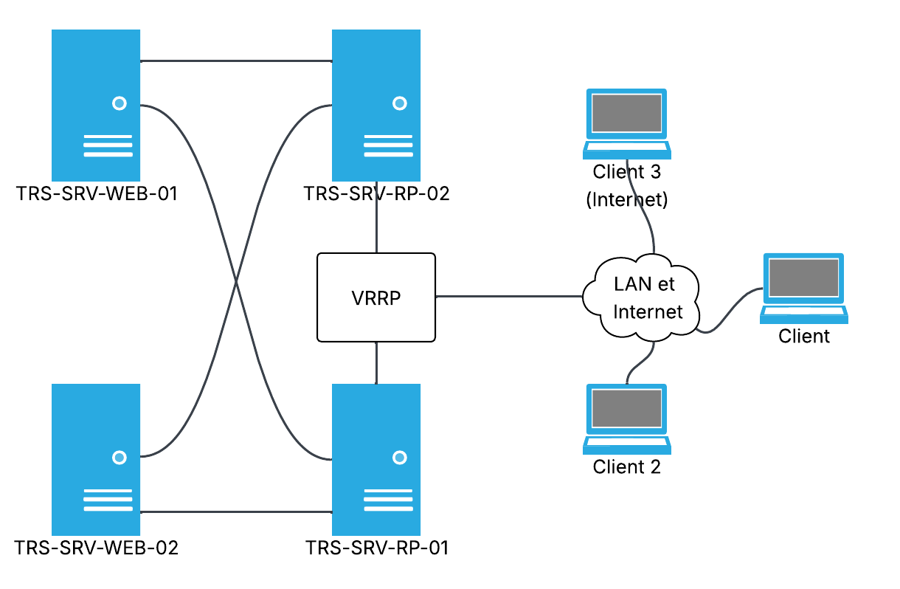

# Mise en place de la haute disponibilité avec HAProxy et VRRP

## Contexte

Dans le cadre de l’amélioration de la **visibilité** et de la **continuité de service** du site web vitrine de SportLudique (`tours.sportludique.fr`), la DSI souhaite mettre en place une infrastructure **hautement disponible**.
L’objectif est de garantir un accès au site même en cas de panne d’un serveur, en assurant une **répartition de charge** ainsi qu’une **tolérance aux pannes réseau ou matérielles**.

Pour cela, l’architecture retenue repose sur :

* **Deux serveurs HAProxy** (TRS-SRV-RP-01 et TRS-SRV-RP-02) configurés en haute disponibilité via **VRRP**
* **Deux serveurs web** (TRS-SRV-WEB-01 et TRS-SRV-WEB-02) hébergeant le contenu du site
* Une adresse IP virtuelle commune, assurée par VRRP, utilisée comme point d’entrée unique
* Une publication du site à la fois sur le **réseau local (LAN)** et **Internet**
* Une gestion des **sessions persistantes** pour les utilisateurs, basée sur l’adresse IP
* Une **connexion sécurisée HTTPS**, avec un certificat signé par l’autorité STS Root R2
* Une entrée DNS pour le domaine `tours.sportludique.fr` pointant vers l’IP virtuelle du cluster

---

## Schéma de l'architecture

Voici le schéma illustrant l’infrastructure redondée avec VRRP et HAProxy :

---

## Objectifs techniques

* Répartition de charge automatique entre plusieurs serveurs web
* Bascule transparente en cas de défaillance d’un serveur HAProxy
* Support des connexions HTTPS avec certificat TLS
* Gestion des sessions utilisateurs grâce à la persistance IP
* Accessibilité depuis le LAN interne et depuis Internet via NAT/PAT ou DMZ
* Enregistrement DNS adéquat dans le serveur local et public, si nécessaire