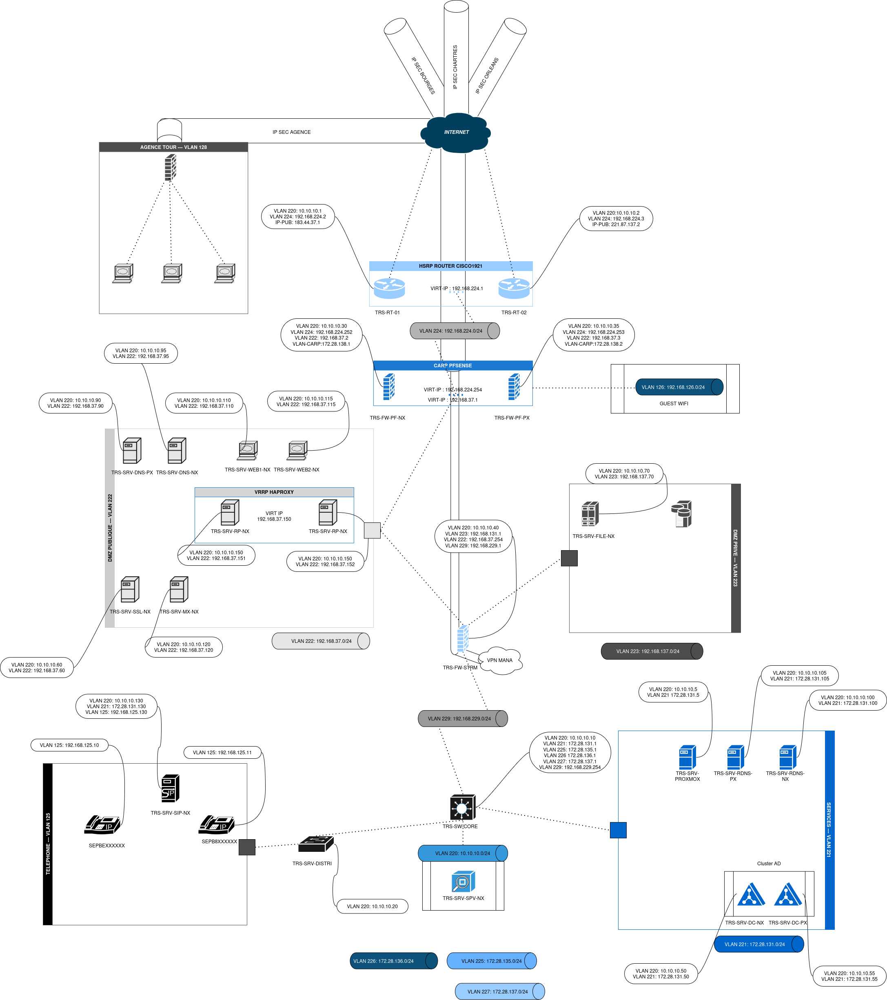

# Introduction

Bienvenue dans la documentation du **Projet SIO2** réalisée par Stefano TRIOLO et Benjamin BACLE.

## Contextualisation

L'entreprise **SportLudique SARL** est spécialisée dans la vente d'articles de sport et de loisirs. Elle compte **452 employés** répartis sur **4 sites** dans la région Centre. Le système d'information (SI) est virtualisé à l'aide des solutions **Proxmox** et **Nutanix**.

### Pourquoi cette prestation ?

Un audit réalisé en **2023** a mis en lumière plusieurs problèmes :

- Processus hétérogènes
- Coûts élevés
- Faible réactivité
- Gestion complexe du parc informatique
- Sécurité insuffisante

### Objectifs pour 2024-2025

La Direction des Systèmes d'Information (DSI) vise plusieurs objectifs :

- Réduire les coûts
- Améliorer l'infrastructure
- Renforcer la sécurité

